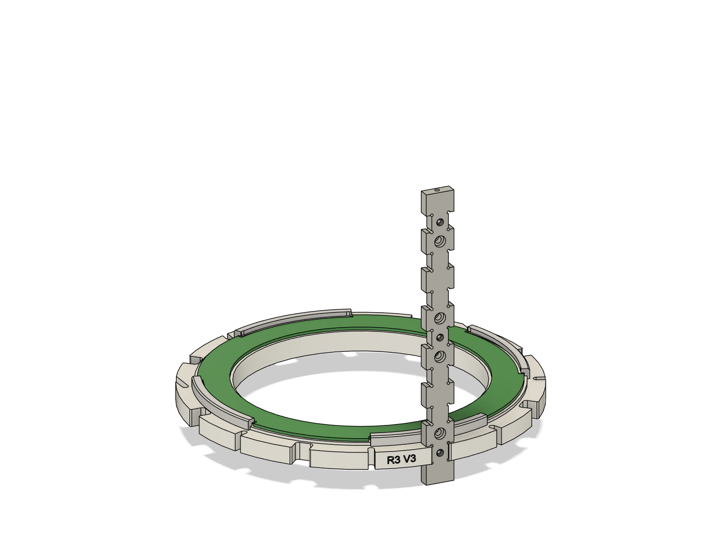
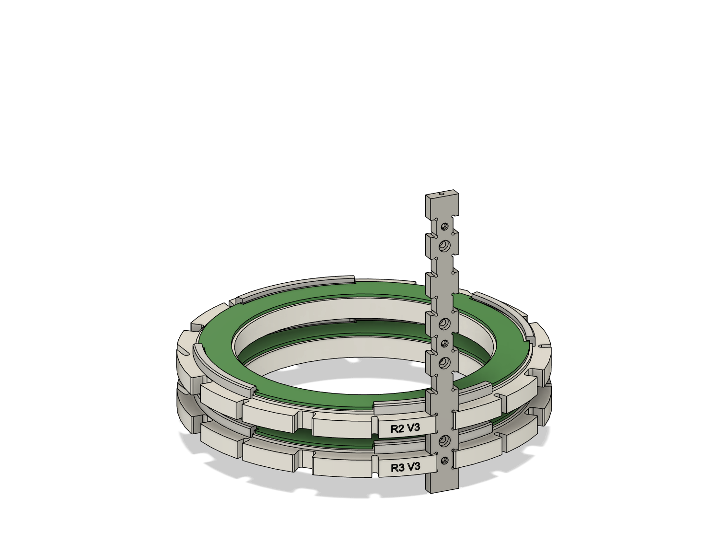
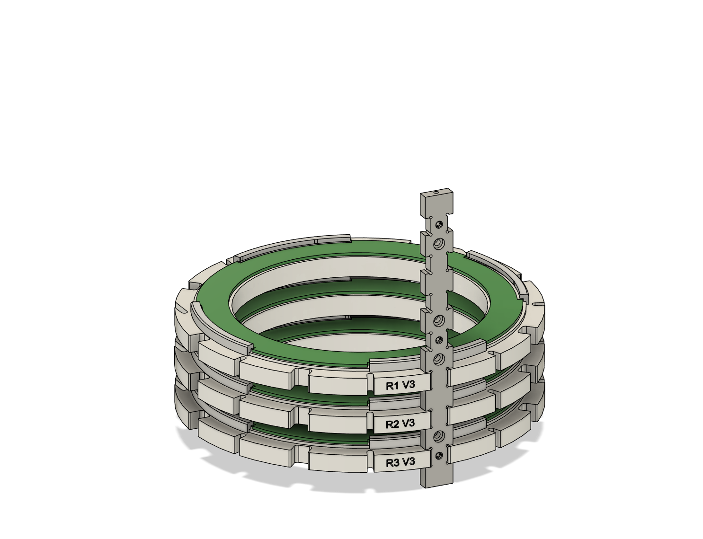
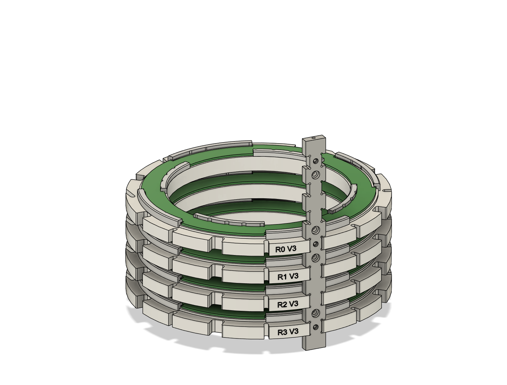
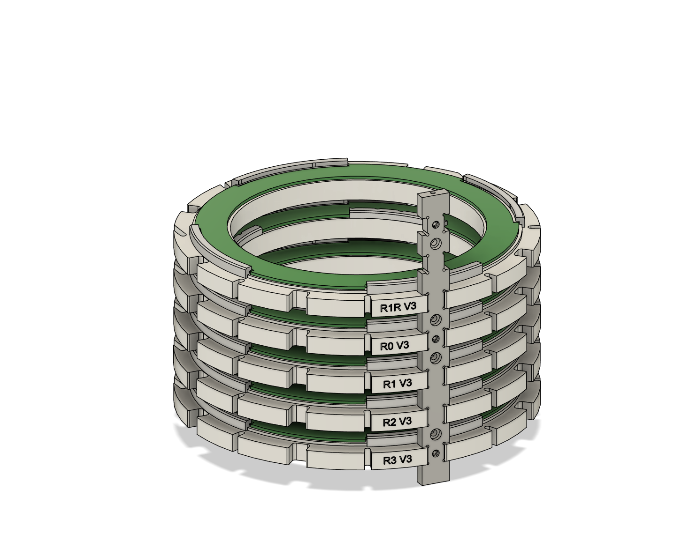
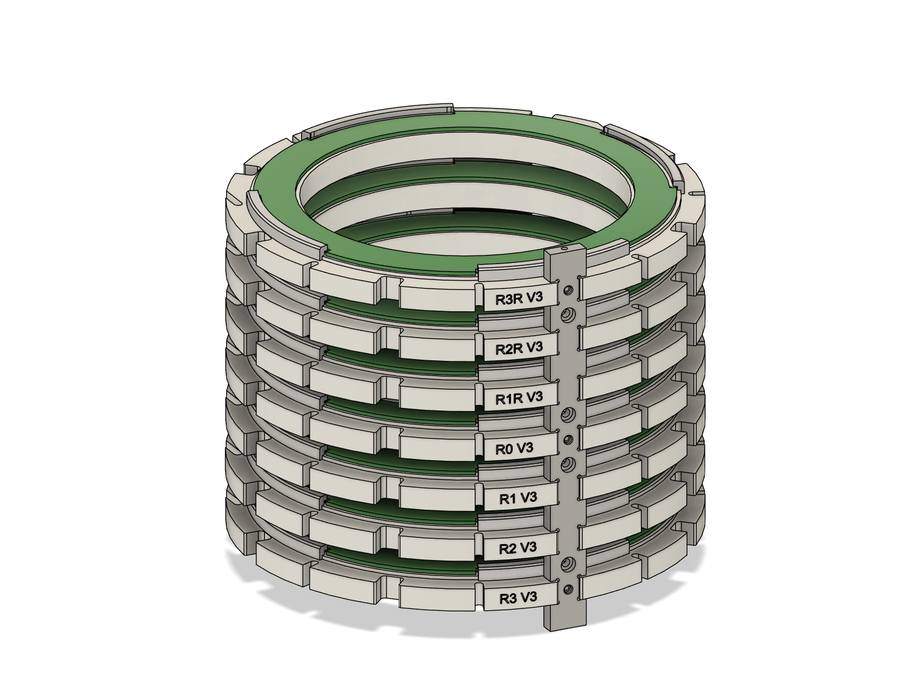
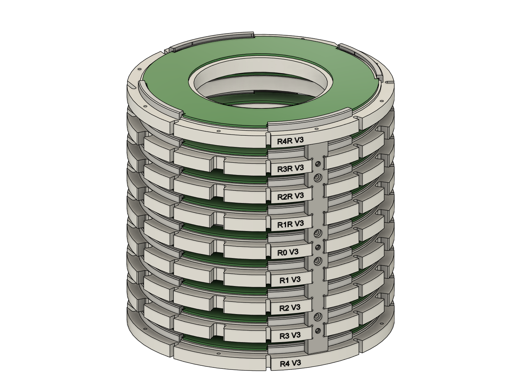
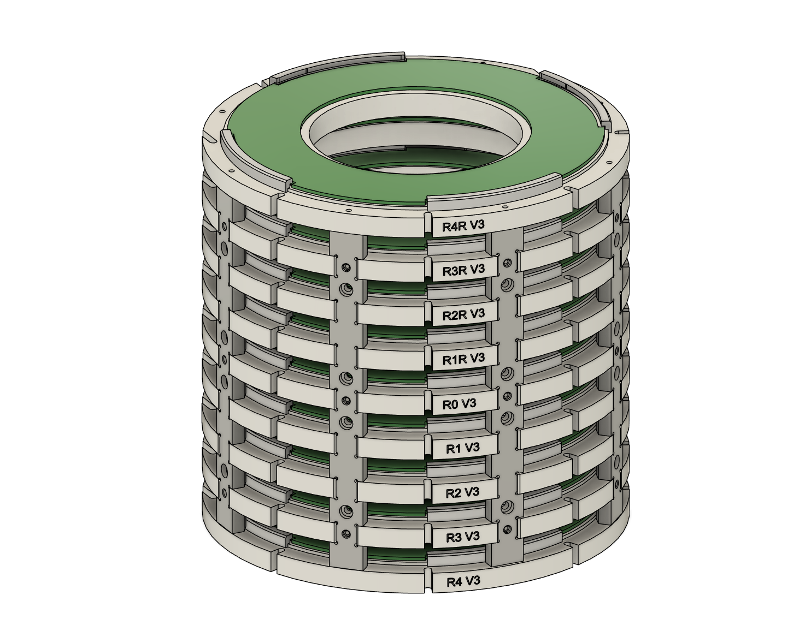

# Frame Assembly

Once the magnets are mounted securely into each ring, and the plexi-glass is twist locked into place, the rings are ready to be assembled into a single assembly.
This part can be a bit tricky with the current design and future iterations will need modifications to streamline this process.

> [!NOTE]
> Rings 4 and 4R have different dimensions than the rest of the rings and will be assembled last, acting like end caps to the structure.

### Step 1: 
Start with rings R3 and R2. Taking only one of the locating bars, insert the two rings into their apropriate slots. Keep in mind the orientation of each ring is the same and the version labels should all face the same direction.

| Mounting R3 | Mounting R2 |
|:--:|:--:|
|||

### Step 2: 
Insert rings R1 and R0.

| Mounting R1 | Mounting R0 |
|:--:|:--:|
|||

### Step 3: 
Insert rings R1R and R2R.

| Mounting R1R | Mounting R2R |
|:--:|:--:|
|||

### Step 3: 
Insert ring R3R

| Mounting R3R | 
|:--:|
||

### Step 3: 
Attach rings R4 and R4R, attach the rest of the locating bars and R4 and R4R into the locating bars.

| Mounting R4 and R4R | Mounting Locating Bars |
|:--:|:--:|
|||

