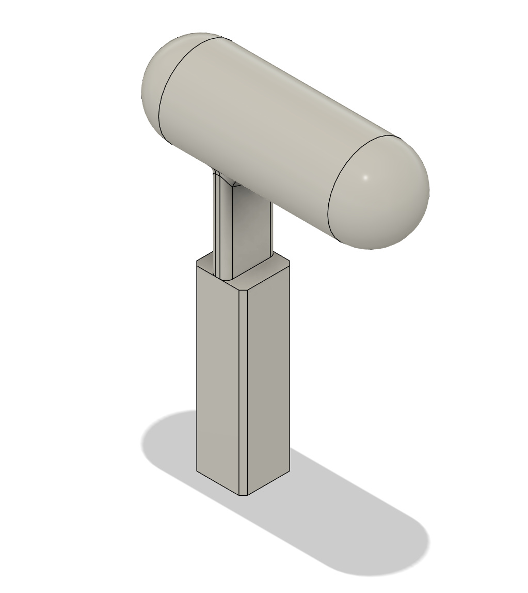
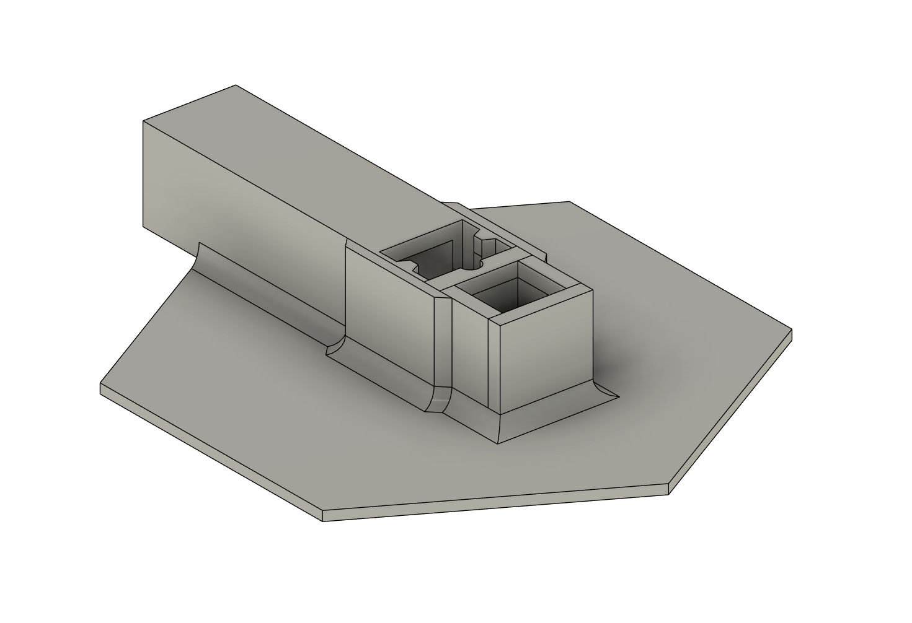
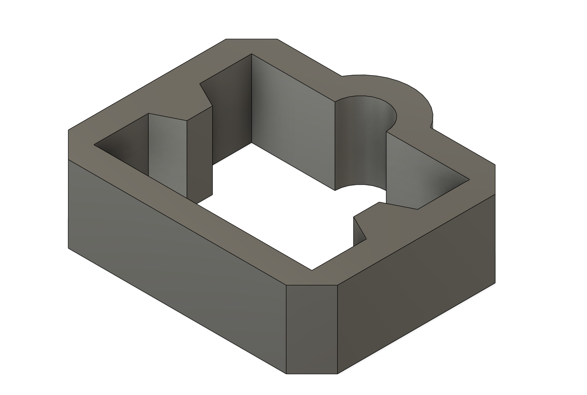

# Inserting the Magets into the rings

Now that the necessary parts of the frame are printed, the tools to guide the magnets into their housings need to be printed.
After having done this process once, I found that printing the tools with a resin printer yielded a better print quality. They can still be printed with an FDM printer though (using the same settings as the frame).

Tools to print:
  - [ ] [Stamp](../../Build/Tools/stamp-Body.step)
  - [ ] [Holder](../../Build/Tools/holder-Body.step)

| Stamp Model | Holder Model |
|:--:|:--:|
|||   

## Holder Modifications
I would also like to note that the current design of the holder was not ideal. The design was based off of usage for the origianl OSII ONE. With the addition of the clips designed to hold the plexi-glass on the ring, they constantly obstructed the stamp. A modification was made to raise the holder design in an attemp to counter this. This is also not a great solution, but it did end up holding for the duration of the mounting process.

The file for small modification can be found here:
  - [ ] [Fusion 360 file](../../Build/Tools/holder-modv2.f3d).
  - [ ] [DXF file](../../Build/Tools/holder_modv2.dxf).

| Stamp Mod Installed | Stamp Model |
|:--:|:--:|
|||
