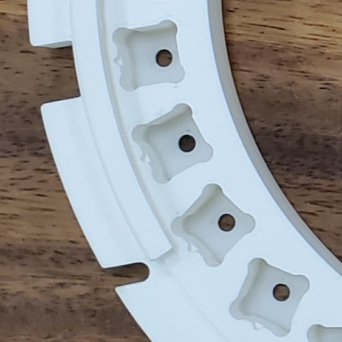
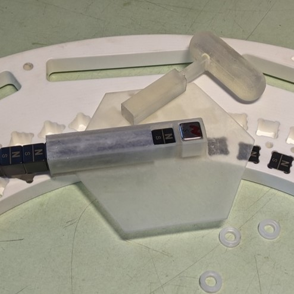

# Inserting the Magets into the rings

Now that the necessary parts of the frame are printed, the insertion of the magnets into each ring can be done.

## Inserting the Magnets
Now that the holder and stamp are ready, let's start inserting the magnets into the rings. The process that was used may need improvement, but this was how they were mounted. The process is factory-like in nature and takes patience.

### Step 1: Test the Magnet
Take a single magnet and test it's $\vec{B}$- Field and polarity. Refer to the [Magnet Test Station](Docs/Tools/MagnetTestStation.md).

### Step 2: Insert the Magnet
Take your labeled magnet and align your marking to the notch of one of the holes in the ring.

| Magnet Housing Notch | Stamp in Use |
|:--:|:--:|
|||
