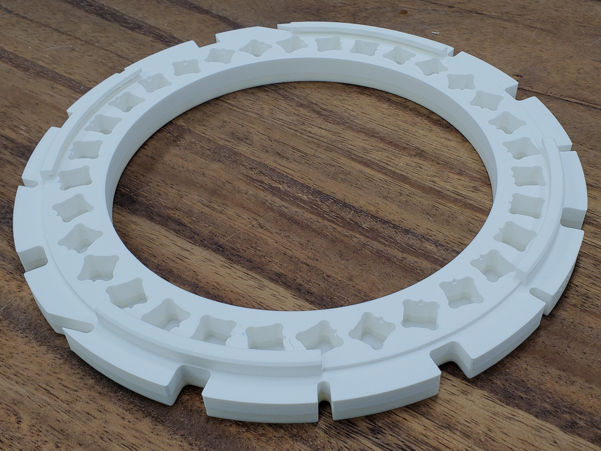
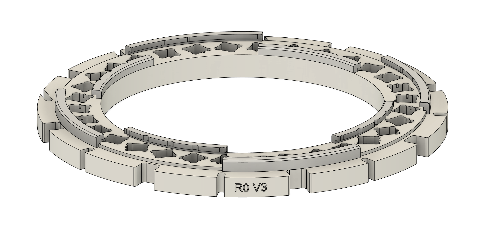
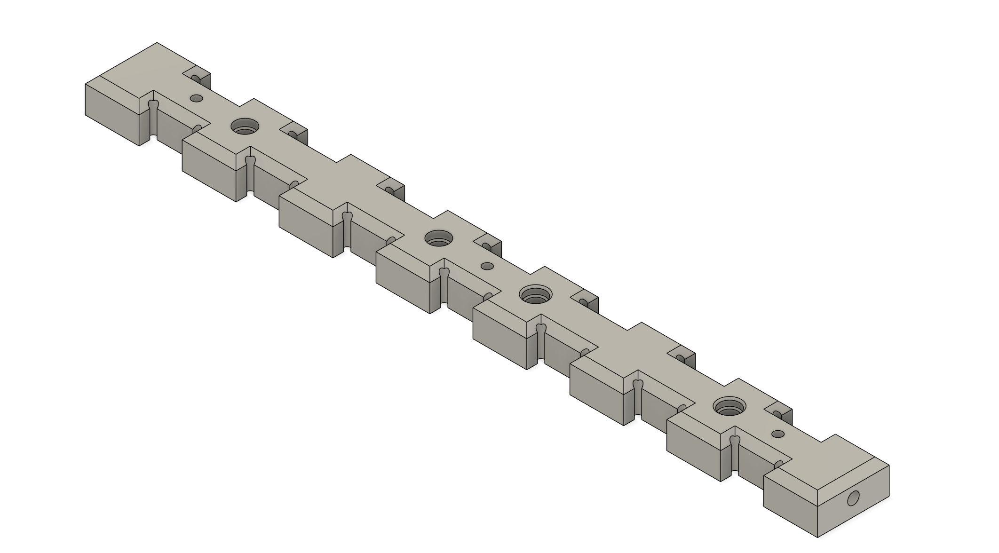

# Printing the Frame

## Printer settings and consumables
Printers Used: 
  - Prusa MK3.9 (Heatbed = Steel)
  - Prusa XL (Heatbed = Satin Powder-Coated)
    
Filament & Filament Settings:
  - 3D Jake eco PLA Tough: Transparent
  - Extruder Temp: 205 C
  - Bed Temp: 60 C
  - Nozzle Diameter: 0.40 mm
  - Layer Height: 0.20 mm (speed)

> [!NOTE]
> All printer settings are set in perspective to PrusaSlicer

## About the Rings
| Ring Example | Version Labelling |
| :---: | :---: |
|||

There are 9 rings to print in total. Each ring is physically labeled depending on location and orientation. Below I will elaborate on how the ring itself is labeled, what it refers to, and the filename it correlates to. It is good to note that the lower case version numbers $${\color{orange}v3 \space versus \space V3}$$ are artifacts from the versioning within Fusion 360. It is wise to simply use the latest Fusion version when possible.

For example: 
  - [ ] R4 V3 = Ring 4 version 3 = Ring_4_V3 v10.f3z
  - [ ] R4R V3 = Ring 4 Rotated version 3 = Ring_4_V3_180 v3.f3z

For each ring, the Fusion 360 files and the DXF files can be found [here](../Build/HalbachFrame/Rings).

## About the Locating Bar
| Locating Bar | 3D Model |
| :---: | :---: |
|||

There are 8 locating bars that need to be printed for this design. Versions of this file can be found [here](../Build/HalbachFrame/Locating_Bar).
