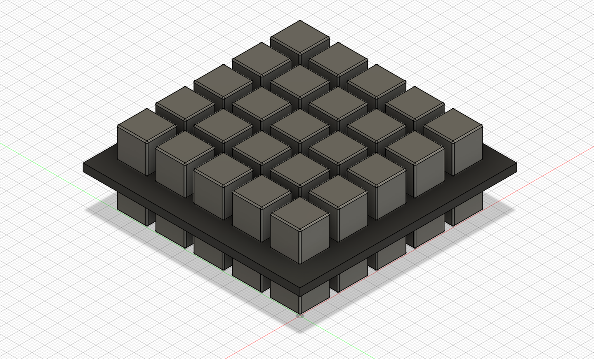
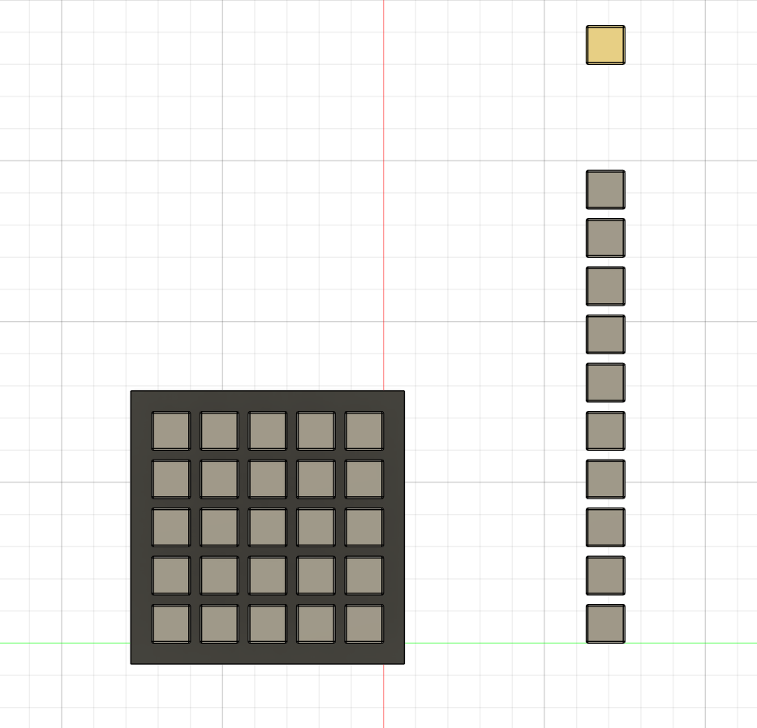
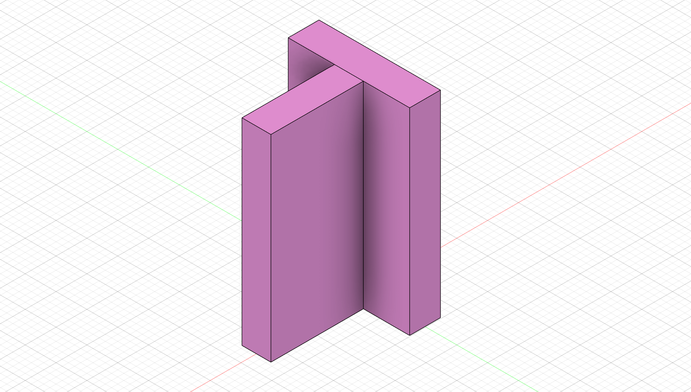
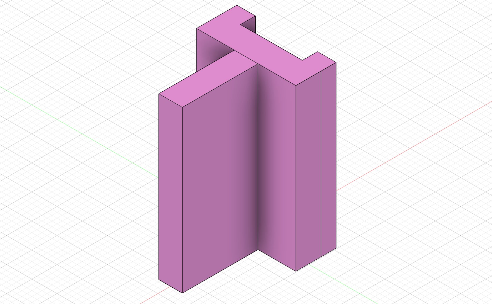

# Magnet Test Station

This section outlines the process for testing the magnets that generate the main static field of the OSI2 MINI. 

> [!NOTE]
> Please follow the [*Reference Magnet*](ReferenceMagnet.md) documentation before starting the magnet assembly.

## Magnetic Pole Identification
Once the reference magnet is established, the magnet test station will then utilize the known magnetic pole and $\vec{B}$- Field of the reference magnet to establish these same traits for the rest of the magnests of the system. This process should be done carefully and checked multiple times to ensure proper $\vec{B}$- Field alignment.

> [!CAUTION]
> Improper magnetic pole alignment and $\vec{B}$- Field strength can cause problems with $\vec{B}$- Field inhomogeneity and make imaging impossible for the MRI.

1. Separate one plane of the magnets from the batch of magnets. In the case of our current setup, the magnets had a divider in between planes.

  | Block of magnets | Modelled |
  | :---: | :--: |
  || |

2. From the plane of magnets, form a single row. This technique aligns all of the poles of that row. I found that only doing one plane at a time minimizes the handling of the magnets, which reduces the potential of them attracting each other and breaking or chipping.

  | Row of magnets | Modelled |
  | :---: | :--: |
  || |

3. Next, pull one magnet from the row at a time. Set it into the [*Magnet Test Station*](../../Build/Tools/Frame-TestMagnetSupport.step) to double check pole orientation as well as ensuring that its $\vec{B}$- Field stregnth is within specification. In this setup, [*Spacer_A0*](../../Build/Tools/Spacer_A0-Spacer.step) or [*Spacer_A1*](../../Build/Tools/Spacer_A1-Spacer.step) is optimal for holding the 12mm magnets.

  | Spacer_A0 | Spacer_A1 | Magnet Test Station |
  | :---: | :--: |:--: |
  ||||
