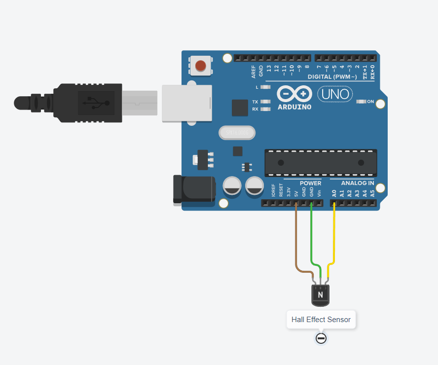
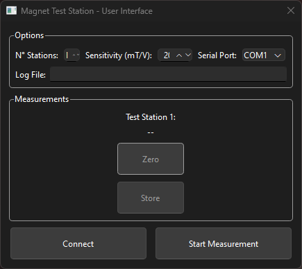
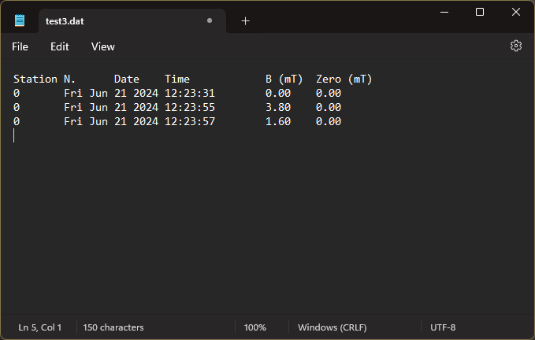
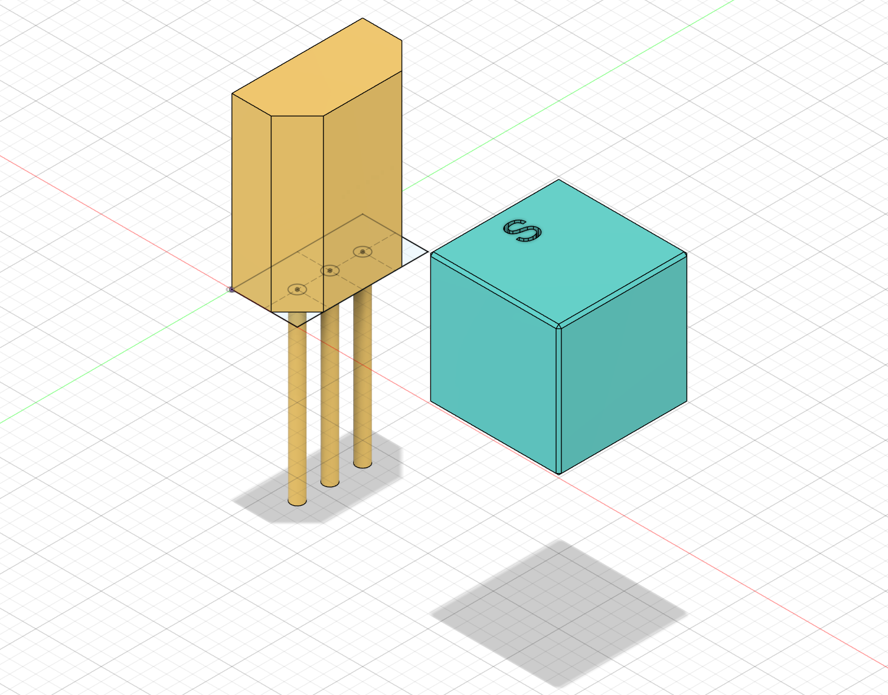
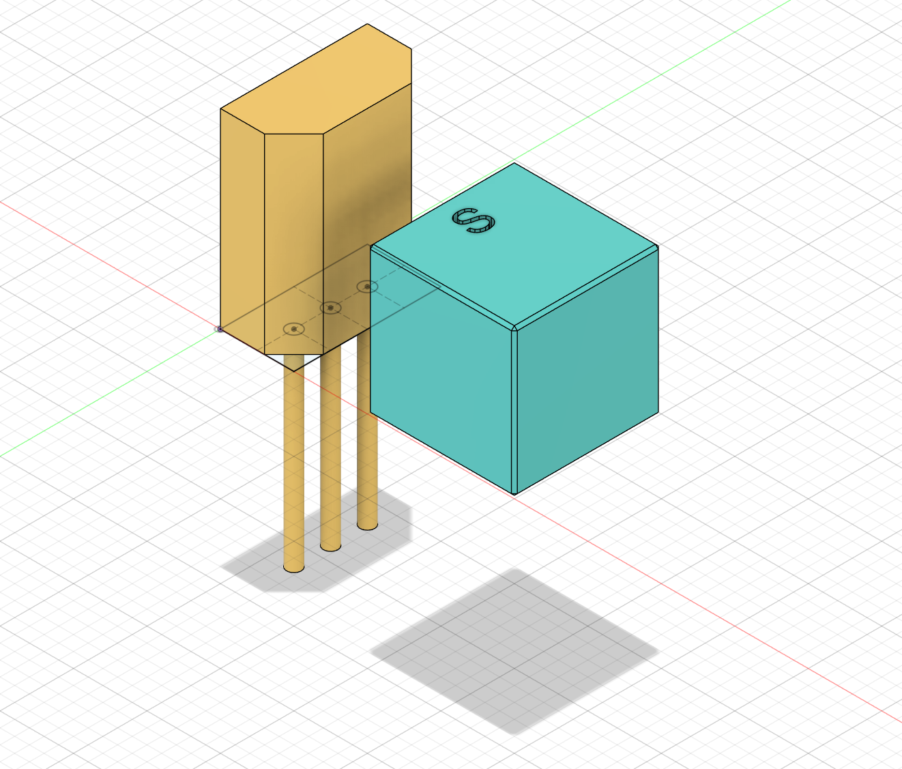

# Establishing the Reference Magnet

A reference magnet was used to check the magnetic field strength ($\vec{B}$- Field) and polarization of the Neodymium magnets used in the OSI<sup>2</sup> MINI build.

## Required Hardware
- [ ] 1 Arduino Uno (or similar Arduino product)
- [ ] 1 USB cable (to connect the Arduino to the computer)
- [ ] 3 jumper cables (to connect the Hall Effect Sensor to the Arduino)
- [ ] 1 Computer
- [ ] 1 [Hall Effect Sensor](../A1302K-67Y_hall_sensor.pdf)
- [ ] 1 [*Magnet Test Station*](../../Build/Magnets)
- [ ] 1 Spacer ([*Spacer_A0*](../../Build/Tools/Spacer_A0-Spacer.step) or [*Spacer_A1*](../../Build/Tools/Spacer_A1-Spacer.step))
- [ ] 1 Neodymium Magnet (this becomes your reference)

## Required Software
- [ ] Python 3 with libraries:
  + PyQt6
  + numpy
  + pyserial

## To Obtain a Reference Magnet
  1. Select one of the magnets from the batch.
  2. Inspect magnet to ensure there are no damages to the magnet.

  | Damaged Magnet 1 | Damaged Magnet 2 |
  | :---: | :---: |
   | 

  3. Insert the magnet and Hall Effect sensor into the [*Magnet Test Station*](../../Build/Magnets).

  | Magnet and Sensor in test station | Sensor Wiring |
  | :---: | :--: |
  |||
  
  5. Download the [*Arduino Script*](../../Software) to interface with the Arduino.
      - Connect the Arduino to your USB port.
      - Ensure your wiring matches the above schematic.
      - Update the analog pin name to which the Hall sensor is connected to inside the Arduino sketch code.
          ```cpp
            short pins[] = {A0};
          ```
      - Upload the Arduino sketch to the Arduino.

  7. Keep the Arduino connectedd to your computer and make sure you have downloaded the [*Python Scripts*](../../Software).
      - Run the Python script `mainInterface.py` to trigger the UI.
      - In the $${\color{lightgreen}Options}$$ section, properly fill out the number of Hall sensors, sensitivity, serial port the Arduino is connected, and file location/name.
      - Press $${\color{orange}Connect}$$ to establish communication with the Arduino.
      - Press $${\color{orange}Start \space Measurements}$$ to start a live measurement of the magnetic field.
      - Press $${\color{orange}Store}$$ to log individual points into a log file.
      - Press $${\color{orange}Zero}$$ to set a zero point during measurement.
        
  | mainInterface.py | log file |
  | :---: | :---: |
   | 
  

## Understanding the Hall Effect
> [!NOTE]
> Whether the north or south pole of the magnet is facing the Hall Effect sensor is irrelevant. The important part is ensuring that which ever pole you choose, you are consistent throughout the project.

For now, let's assume we want the south pole of the magnet to be marked.

Once the Arduino is properly connected and the Magnet Testing Script recognizes the Hall Effect sensor, understanding what the readout of the sensor represents is important. The orientation of the Hall Effect sensor, as well as the magnet, affect the readout. With the front of the senor facing the magnet, the readout should be *NEGATIVE* if the South Pole of the magnet is facing the sensor. Moving the magnet closer to the sensor causes a voltage drop, while a voltage increase occurs when the magnet is moved away from the sensor. 

| Lower Voltage | Higher Voltage |
| :---: | :--: |
|| 

The purpose of the magnet test station is then to force the magnet to be at a consistent distance from the sensor. This will come in handy later on when we test the rest of the magnets for their $\vec{B}$- Field. A magnet can then easily be identified if its $\vec{B}$- Field is out of specification.

