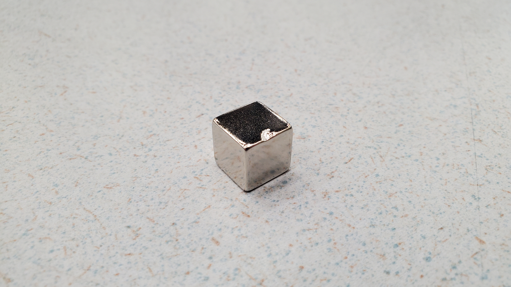
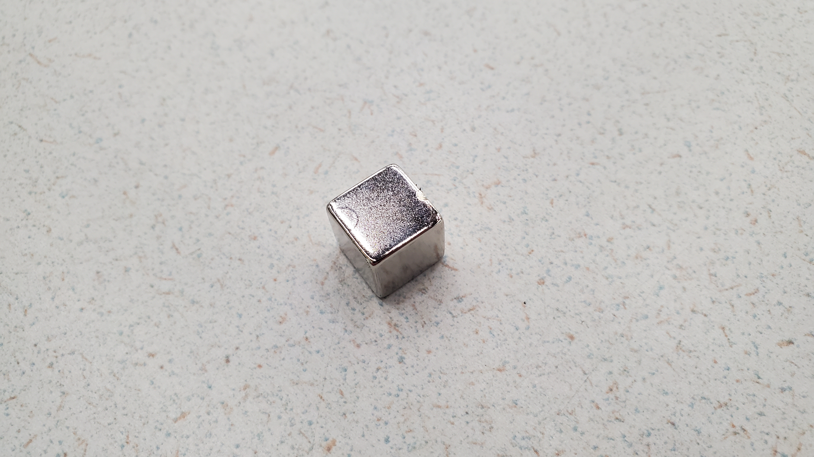

# Establishing the Reference Magnet

A reference magnet was used to check the magnetic field strength ($\vec{B}$- Field) and pole alignment of the Neodymium magnets used in the OSI2 MINI build.

## To Obtain a Reference Magnet
  1. Select one of the magnets from the batch.
  2. Inspect magnet to ensure there are no damages to the magnet.
    

      
       
    

  3. Insert the magnet and Hall Effect sensor into the [*Magnet Test Station*](../../Build/Magnets).
    

      
    
     
  4. Download the [*Magnet Testing Script*](../osii_MRI/Software) to interface with the Arduino.
  5. Connect the Arduino to your computer and upload the [*Python Scripts*](./osii_MRI/Software) to the Arduino board.

## Running the Code
Once the Arduino is properly connected and the Magnet Testing Script recognizes the Hall Effect sensor, understanding what the readout of the sensor represents is important. The orientation of the Hall Effect sensor, as well as the magnet, affect the readout. 

> [!NOTE]
> Whether the north or south pole of the magnet is facing the Hall Effect sensor is irrelevant. The important part is ensuring that which ever pole you choose, you are consistent throughout the project.

For now, let's assume we want the south pole of the magnet to be marked. Changing the distance between the magnet and the sensor will change the output voltage of the sensor. If the "front face" of the Hall Effect sensor is facing the 
