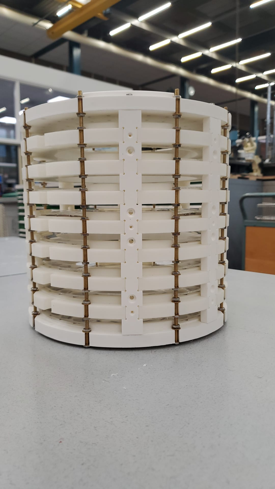

# OSII Mini 

Documentation for building the open source ultra low-field MRI for education

Magnetic Resonance Imaging (MRI) is one of the most powerful and versatile non-invasive medical imaging devices. 
Ultra low-field MRI scanners such as __OSII One__ have recently reached the maturity level of [attempting eligibility for standardization and medical certification](https://www.opensourceimaging.org/). 
These open source projects has pooled the knowledge and experience of many experts and can be built and maintained for a fraction of the price of current instruments. 
Several groups worldwide have succeeded in replicating this device or build similar design. 

This educational project is a collaboration initiated by the [Lili's Proto Lab](https://www.uu.nl/lpl) with the aim of preparing a hands-on workshop for student teams to replicated an OSII-inspired functioning MRI.
Student teams can be a great force in progressing this field. 
Collectively, they can enhance the accuracy and utility of open-source MRI devices through rigorous calibration procedures, iterative testing, and collaboration with experts in both engineering and medical fields.  

## MRI Resources
More information about MRIs and their operations can be found below:
+ [MRI Questions website maintained by Allen D. Elster](https://mriquestions.com/index.html)
+ [OSI2 Repository:](https://gitlab.com/osii) Here you can find additional information about the original OSI2 ONE

## Main features

We are replicating the OSII mini magnet designed by Dr. Joshua Harper from [Sustainable MRI Lab](smrilab.com) which is based on the original work of Thomas O'Reilly and Andrew Webb at Leiden University.

+ __The Halbach magnet:__
	+ 120 mm inner diameter 
	+ DSV 100 x100 x100 mm
	+ 396 magnets 12x12x12 mm
	+ 50 mT
	+ around 1500 Euros for a completed magnet

## Build instructions

At this moment, we are adjusting and testing the magnet design. The build instructions will be posted in the [Build](./Build/) subfolder.

## Outcomes

Our main goal to support the student teams who collaborate in replicating this low field MRI. 
In parallel, all outputs of this collaboration will be cooridnated and shared with the sister MRI project such as the OSII ONE. 

## Team

+ Utrecht University, Lilis Proto Lab:
	+ Project lead: Sanli Faez
	+ Contributors: Zachary Meredith, Low Field Legends (Experiment Design class of 2024)

+ Universidad Paraguayo Alemana: 
	+ Project lead: Joshua Harper
	+ Contributors: 

+ NIST Boulder: 
	+ Project lead: Stephen Ogier
	+ Contributors: Katy Keenan

+ Independent:
	+ Greg Shakar

## Get involved

We don't accept pull request at this moment. Our goal is to open up for external contributions after in November 2024 

This is a bottom-up initiative and participation in the project is on a voluntary basis. If you share the vision and goals of this initiative, we welcome all your compassionate support. 

You can support this initiative by any or all these options:
-	Recommending this workshop to enthusiastic students* in your institute.
-	Providing support, mentorship and expert advice to students who participate.
-	Hosting student teams in your lab/institute after the workshop for enhancing their builds.
-	Contributing to the preparation of the workshop with time, funding, or student assistants.
-	Financial support for purchasing the build materials.

Please contatct Sanli (@sanlifaez), for any inquiries.

## License

This project is licensed under [CERN Open Hardware Licence Version 2 - Weakly Reciprocal](./LICENSE).
Licenses of the individual modules of OSI² ONE apply accordingly.

## (Funding)

This project has recieved an Open Science Hacker grant from the Lili's Proto Lab

